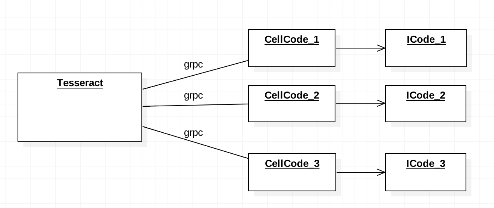
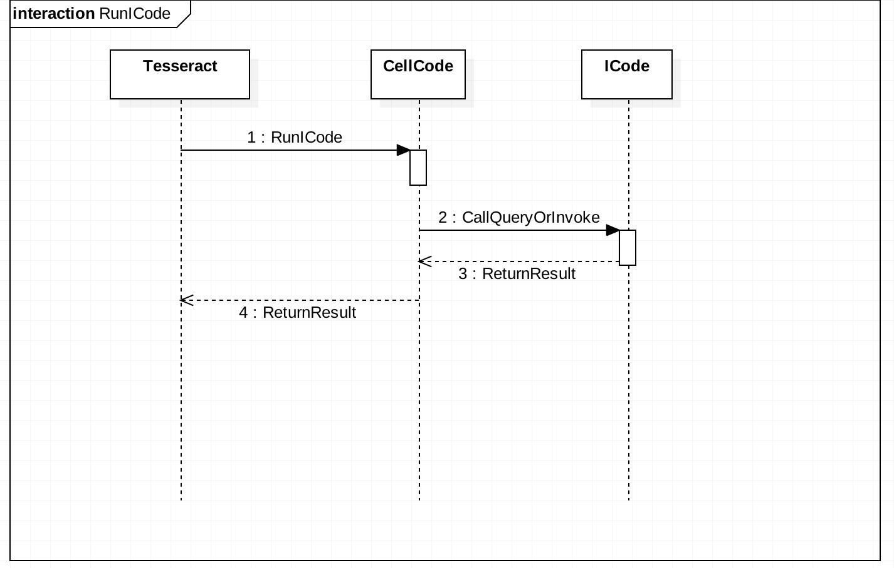
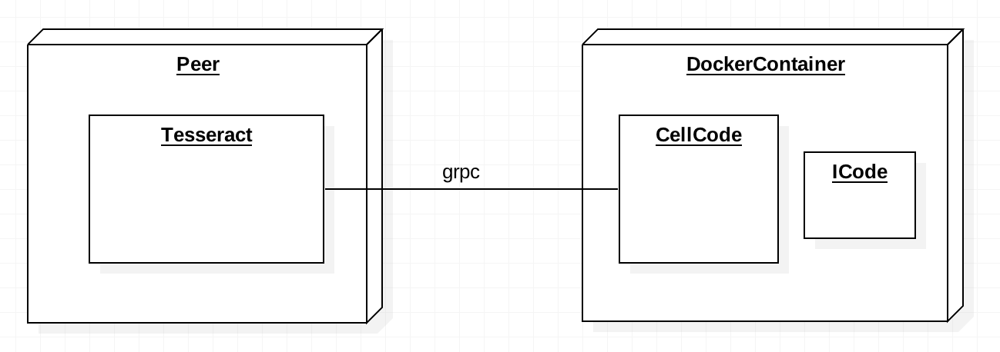

# Architecture

## Logical View

- Tesseract

  다수의 CellCode를 관리하며 Grpc를 통해 CellCode에게 ICode의 Invoke와 Query요청을 보낸다.

- CellCode

  CellCode는 Docker Container 내부에서 돌아가는 독립적인 프로세스로 ICode를 컨트롤한다. CellCode는 grpc를 통해 Tesseract와 통신하며 Tesseract로 부터 Invoke와 Query요청을 받으면 해당하는 요청을 ICode로 실행시키고 결과값을 리턴한다.

- ICode

  ICode는 It-chain위에 돌아가는 SmartContract이다.

  ​

1. Tesseract가 Grpc를 통해 CellCode에게 실행 요청을 전송한다.
2. Grpc로 받은 요청에 따라 Invoke혹은 Query요청을 ICode로 실행한다.
3. ICode는 Invoke 혹은 Query요청을 수행하고 결과를 리턴한다.
4. ICode로 부터 받은 결과를 grpc를 통해 결과를 리턴한다.

## Deployment View

Tesseract를 Peer에 존재하며 ICode의 Deploy시에 CellCode와 ICode는 DockContainer안으로 들어가 DockerContainer내부에서 실행된다.